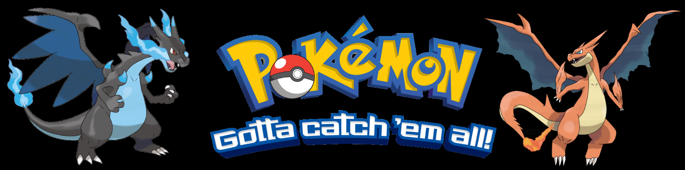

<table>
    <tbody>
        <tr>
            <td>
                
            </td>
        <tr>
    </tbody>
</table>

# <center>Repaso - Mayo</center>

## Introducción:

El profesor Oak de Pueblo Paleta está trabajando en ciertas investigaciones clasificadas
con datos de algunos pokemones, es por eso que te pide ayuda para crear un programa
que le permita obtener datos valiosos.
Tu tarea como developer será la de crear un programa hecho en Python que, según la opción elegida haga las tareas debajo mencionadas.
Te compartimos el json sobre el cual quiere trabajar:

```json
{
    "pokemones": [
        {
            "id": 1,
            "nombre": "bulbasaur",
            "tipo": ["planta"],
            "evoluciones": ["ivysaur", "venusaur"],
            "poder": 4,
            "fortaleza":["agua"],
            "debilidad":["fuego"]
        },
        {
            "id": 4,
            "nombre": "charmander",
            "tipo": ["fuego"],
            "evoluciones": ["charmeleon", "charizard"],
            "poder": 5,
            "fortaleza":["planta"],
            "debilidad":["agua"]
        },
        {
            "id": 5,
            "nombre": "charmeleon",
            "tipo": ["fuego"],
            "evoluciones": ["charizard"],
            "poder": 9,
            "fortaleza":["planta"],
            "debilidad":["agua"]
        },
        {
            "id": 6,
            "nombre": "charizard",
            "tipo": ["fuego", "volador"],
            "evoluciones": ["mega-charizard x", "mega-charizard y", "charizard gigamax"],
            "poder": 18,
            "fortaleza":["planta"],
            "debilidad":["agua"]
        },
        {
            "id": 9,
            "nombre": "blastoise",
            "tipo": ["agua"],
            "evoluciones": [],
            "poder": 18,
            "fortaleza":["fuego", "piedra"],
            "debilidad":["planta", "eléctrico"]
        },
        {
            "id": 172,
            "nombre": "pichu",
            "tipo": ["eléctrico"],
            "evoluciones": ["pikachu", "raichu", "raichu de alola"],
            "poder": 3,
            "fortaleza":["agua"],
            "debilidad":["planta", "piedra"]
        },
        {
            "id": 25,
            "nombre": "pikachu",
            "tipo": ["eléctrico"],
            "evoluciones": ["raichu", "raichu de alola"],
            "poder": 5,
            "fortaleza":["agua", "eléctrico"],
            "debilidad":["planta", "piedra"]
        },
        {
            "id": 26,
            "nombre": "raichu",
            "tipo": ["eléctrico"],
            "evoluciones": [],
            "poder": 20,
            "fortaleza":["agua", "eléctrico"],
            "debilidad":["planta", "piedra"]
        },
        {
            "id": 94,
            "nombre": "gengar",
            "tipo": ["fantasma", "veneno"],
            "evoluciones": [],
            "poder": 30,
            "fortaleza":["psíquico", "volador"],
            "debilidad":["siniestro"]
        },
        {
            "id": 144,
            "nombre": "articuno",
            "tipo": ["hielo", "volador"],
            "evoluciones": [],
            "poder": 30,
            "fortaleza":["volador", "planta"],
            "debilidad":["fuego", "agua", "acero"]
        },
        {
            "id": 145,
            "nombre": "zapdos",
            "tipo": ["eléctrico", "volador"],
            "evoluciones": [],
            "poder": 30,
            "fortaleza":["agua"],
            "debilidad":["planta", "piedra"]
        },
        {
            "id": 146,
            "nombre": "moltres",
            "tipo": ["fuego", "volador"],
            "evoluciones": [],
            "poder": 30,
            "fortaleza":["planta", "eléctrico"],
            "debilidad":["agua", "piedra"]
        },
        {
            "id": 150,
            "nombre": "mewtwo",
            "tipo": ["psiquico"],
            "evoluciones": ["mega-mewtwo x", "mega-mewtwo y"],
            "poder": 25,
            "fortaleza":["agua", "planta", "fuego", "eléctrico"],
            "debilidad":["fantasma", "oscuridad"]
        },
        {
            "id": 151,
            "nombre": "mew",
            "tipo": ["psiquico"],
            "evoluciones": [],
            "poder": 24,
            "fortaleza":["agua", "planta", "fuego", "eléctrico"],
            "debilidad":["fantasma", "oscuridad"]
        },
        {
            "id": 448,
            "nombre": "lucario",
            "tipo": ["lucha", "acero"],
            "evoluciones": ["mega lucario"],
            "poder": 24,
            "fortaleza":["piedra", "agua", "hielo", "planta"],
            "debilidad":["eléctrico", "agua", "fuego", "psíquico", "volador"]
        }
    ]
}
```

El profesor Oak quiere que el menú de la aplicación posea las siguientes opciones (Marcadas en color)


### **Nivel 1 - Elemental** (crear archivo poke_lib_elemental.py)

```
1 - Imprimir nombre de pokemones.
2 - Imprimir pokemones que tengan un ID par
3 - Imprimir pokemones que tengan un ID múltiplo de 25
4 - Imprimir nombre de pokemones con su ID de prefijo.
5 - Imprimir los pokémons con más poder y cuánto poder tienen (misma fuerza)
6 - Imprimir los pokémons con menos poder y cuánto poder tienen (misma fuerza)
```

### **Nivel 2 - Básico** (crear archivo poke_lib_basico.py)
```
7 - Imprimir el promedio de poder de pokemones que entre sus tipos tenga 'psíquico'
8 - Imprimir el promedio de poder de pokemones que entre sus tipos tenga 'fuego'
9 - Imprimir el promedio de poder de pokemones que entre sus tipos tenga 'eléctrico'
```

### **Nivel 3 - Intermedio** (crear archivo poke_lib_intermedio.py)
```
10 - Imprimir pokemones que posean más de un tipo
11 - Imprimir pokemones que posean más de un tipo y su cantidad
12 - Imprimir pokemones que posean más de una evolución
13 - Imprimir pokemones que posean más de una evolución y su cantidad
14 - Imprimir pokemones que posean más de una fortaleza
15 - Imprimir pokemones que posean más de una fortaleza y su cantidad
16 - Imprimir pokemones que posean más de una debilidad
17 - Imprimir pokemones que posean más de una debilidad y su cantidad
```

### **Nivel 4 - Intermedio-Avanzado** (crear archivo poke_lib_int_avan.py)
```
18 - Imprimir los tipos de cada pokemon
19 - Imprimir las evoluciones de cada pokemon
20 - Imprimir las debilidades de cada pokemon
21 - Imprimir las fortalezas de cada pokemon
```

### **Nivel 5 - Avanzado** (crear archivo poke_lib_avanzado.py)
```
22 - Imprimir pokemones agrupados por tipo. (Si posee más de un tipo, deberá aparecer en cada uno de ellos)
23 - Imprimir pokemones con su id, nombre, fuerza, tipos, evoluciones, fortalezas y debilidades.
24 - Filtrar pokemones por tipo y guardarlos en un JSON.
25 - Salir de la aplicación.
```

Para que inicies tu trabajo, te regalamos dos funciones para que pongas en tu librería ELEMENTAL la cual será la primera que hagas, simplemente copia y pega el codigo para poder continuar

```python
import json
import os


_b_red: str = '\033[41m'
_b_green: str = '\033[42m'
_b_blue: str = '\033[44m'
_f_white: str = '\033[37m'
_no_color: str = '\033[0m'


def imprimir_mensaje(mensaje: str, tipo_mensaje: str) -> None:
    """
    This function prints a message with a specified type (error, success, or info) in a colored format.
    :param mensaje: a string containing the message to be printed
    :param tipo_mensaje: The parameter "tipo_mensaje" is a string that represents the type of message
    that will be printed. It can be "Error", "Success", or "Info"
    """
    match tipo_mensaje.strip().capitalize():
        case 'Error':
            print(f'{_b_red}{_f_white}> Error: {mensaje}{_no_color}')
        case 'Success':
            print(f'{_b_green}{_f_white}> Success: {mensaje}{_no_color}')
        case 'Info':
            print(f'{_b_blue}{_f_white}> Information: {mensaje}{_no_color}')
       
def limpiar_consola() -> None:
    """
    This function clears the console screen and waits for user input to continue.
    """
    _ = input('Presione una tecla para continuar...')
    if os.name in ['ce', 'nt', 'dos']: os.system("cls")
    else: os.system("clear")
```

<br><br><br>

Te dejamos algunos tips para que te guies:

## Para los ejercicios ELEMENTAL, crear un archivo llamado **_poke_lib_elemental.py_** y poner allí las funciones correspondientes. Importar lo que sea necesario!

* 01.0 - 
```
Crear la función "pokedex_leer_archivo" la cual recibira como primer parámetro la ruta del archivo a leer (carpetas/nombre.extension) y como segundo parámetro la clave del diccionario el cual queremos traernos su valor (una lista)
Retorno: La lista de diccionarios que representará pokemones.
```
* 01.1 - 
```
Crear la función "capitalizar_palabras" la cual recibira como parámetro un texto (que puede contener una o más palabras) y debe aplicar capitalización a cada palabra del mismo.
Retorna: El mismo texto con todas las palabras con la primera letra mayúscula.
```
* 01.1.1 - 
```
Crear la función "obtener_nombre_pokemon" la cual recibira por
parámetro un diccionario que representará al pokemon, la función deberá obtener el nombre y retornarlo como un string.
Tips:
    Reutilizar la función: -> "capitalizar_palabras"
Retorno: El nombre del pokemon, capitalizado
```
* 01.2
```
Crear la funcion "pokedex_imprimir_nombre_pokemones" la cual recibira por
parámetro una lista de pokemones e imprimirá sus nombres.
Tips:
    Reutilizar las funciones: -> "obtener_nombre_pokemon" e "imprimir_mensaje"
    Informar: En caso de no haber pokemones en la lista, se deberá imprimir un mensaje de error.
Retorno: None
```

* 02.1
```
Crear la función "tiene_id_par" la cual recibira por parámetro un diccionario que representará al pokemon y verificará que su id sea par.
Retorno: True en caso de que sea par, caso contrario retornara False.
```
* 02.2
```
Crear la función "obtener_id_pokemon" la cual recibira por
parámetro un diccionario que representará al pokemon, la función deberá obtener el id y retornarlo como un string.
Retorno: El ID del pokémon como un string.
```
* 02.3
```
Crear la función "pokedex_imprimir_pokemon_id_par" la cual recibira por parámetro la lista de pokemones y deberá imprimir solo los que cumplan con la condición de tener un ID par.
Tips:
    Reutilizar las funciones: -> "tiene_id_par", "imprimir_mensaje" y "obtener_nombre_pokemon"
Retorno: None
```

* 03.1
```
Crear la función "id_multiplo_25" la cual recibira por parámetro un diccionario que representará al pokemon y verificará que su id múltiplo de 25.
Retorno: True en caso de que sea múltiplo de 25, caso contrario retornara False.
```
* 03.2
```
Crear la función "pokedex_imprimir_pokemon_id_mul_25" la cual recibira por parámetro la lista de pokemones y deberá imprimir solo los que cumplan con la condición de tener un ID múltiplo de 25.
Tips:
    Reutilizar las funciones: -> "id_multiplo_25", "imprimir_mensaje" y "obtener_nombre_pokemon"
    Informar: En caso de no haber pokemones en la lista, se deberá imprimir un mensaje de error.
Retorno: None
```
* 04.1
```
Crear la funcion "nombre_format_pokemon" la cual recibira por
parámetro un diccionario que representará al pokemon, la función deberá
obtener el nombre y su ID y retornarlo como un string formateado
respetando el estilo: #006 - Charizard
Tips:
    Reutilizar las funciones: -> "obtener_id_pokemon" y "obtener_nombre_pokemon"
Retorno: El string formateado como pide el enunciado
```
* 04.2
```
Crear la funcion "pokedex_imprimir_nombres_poke_fmt" la cual recibira
una lista de pokemones y deberá imprimirlos formateados respetando el estilo: #006 - Charizard
Tips:
    Reutilizar las funciones: -> "imprimir_mensaje" y "nombre_format_pokemon"
    Informar: En caso de no haber pokemones en la lista, se deberá imprimir un mensaje de error.


Retorno: None
```
* 05.1
```
Crear la funcion "buscar_valor_pokemon_mas_fuerte" la cual recibira por parámetro la lista de pokemones y un string el cual se utilizará para buscar un 'Maximo' o un 'Mínimo'.
Según lo que reciba en el segundo parámetro se encargará de buscar el número más grande o más pequeño de la clave 'poder' de cada pokemon. Una vez encontrada la retornara como un entero.
En caso de no haber pokemones en la lista, se deberá imprimir un mensaje de error.
Retorno: El valor mínimo o máximo de poder entre todos los pokémones.
```
* 05.2
```
Crear la función "pokedex_pokemones_fuerza_max_min" la cual recibira por parámetro la lista de pokemones y un string el cual se utilizará para buscar un 'Maximo' o un 'Mínimo'.
Primero buscará cuál es el valor Maximo o Mínimo (según el segundo parámetro) y una vez encontrado deberá iterar a los pokemones imprimiendo en consola los que cumplan la condición de tener ese mismo valor en su key 'poder'.
Tips:
    Reutilizar las funciones: -> "buscar_valor_pokemon_mas_fuerte" "imprimir_mensaje" y "nombre_format_pokemon"
    Informar: En caso de no haber pokemones en la lista, se deberá imprimir un mensaje de error.
Retorno: None
```

# Checkpoint 1! Guardando partida…. Bien hecho! 
* Si completaste los ejercicios hasta acá, significa que las 6 primeras opciones de la aplicación ya están listas! ¡Tomate un descanso y cuando estés list@ continúa tu misión!
* Al completar esta parte del trabajo obtuviste tu primer Charmander! Continua así para que evolucione!

<table>
    <tbody>
        <tr>
            <td>
                
            </td>
        <tr>
    </tbody>
</table>

---

<br><br><br>

## Para los ejercicios BÁSICO, crear un archivo llamado **_poke_lib_basico.py_** y poner allí las funciones correspondientes. Importar lo que sea necesario!

* 07.1
```
Crear la función "buscar_promedio_segun_atributo" la cual recibira por parámetro la lista de pokemones como primer parámetro,
el nombre de la clave en la cual buscará un valor específico como segundo parámetro y como tercer parámetro el valor a buscar que debe buscar en la key.
Al encontrar el/los pokemones que tengan dicho valor en la key,
deberá calcular el promedio de "poder" entre todos los pokemones que cumplan la condición.
Retorno: El promedio como float
```
* 07.2
```
Crear la función "pokedex_promedio_poder_tipo" la cual recibira por parámetro la lista de pokemones como primer parámetro,
el nombre de la clave en la cual buscará un valor específico como segundo parámetro y como tercer parámetro el valor a buscar que debe buscar en la key.
Al encontrar el valor promedio deberá imprimir un mensaje por consola informandolo.
Ejemplo:
    > El poder promedio de pokemones con tipo psíquico es: 24.5
Tips:
    Reutilizar la función: -> "buscar_promedio_segun_atributo"
    Informar: En caso de no haber pokemones en la lista, se deberá imprimir un mensaje de error.
Retorno: None
```

## Checkpoint 2! Guardando partida…. Bien hecho! 
* Si completaste los ejercicios hasta acá, significa que las 9 primeras opciones de la aplicación ya están listas! ¡Tomate un descanso y cuando estés list@ continúa tu misión!
* Con este logro tu Charmander evolucionó en un Charmeleon! Felicidades! Aun falta un tramo para que sea cada vez mas fuerte!

<table>
    <tbody>
        <tr>
            <td>
                
            </td>
        <tr>
    </tbody>
</table>

---

<br><br><br>

## Para los ejercicios INTERMEDIO, crear un archivo llamado **_poke_lib_intermedio.py_** y poner allí las funciones correspondientes. Importar lo que sea necesario!

* 10.1
```
Crear la funcion "tiene_varios_atributo" la cual recibira como primer parametro un diccionario que representara a un solo pokemon, como segundo parámetro el nombre de la clave la cual deberá chequear que posea más de un elemento (ya que su valor es una lista).
Retorna: En caso de tener más de un elemento, retornara true, false caso contrario.
```

* 10.2
```
Crear la función "podekex_pokemones_varios_atributo" la cual recibira como primer parámetro un diccionario que representara a un solo pokemon, como segundo parámetro el nombre de la clave a buscar.
Al encontrar pokemones que posean más de un atributo (tipo, fuerza, evoluciones o debilidad) deberá imprimirlos.
Ejemplo:
    Pokemones con múltiples evoluciones:
    #001 - Bulbasaur
    #004 - Charmander
    #006 - Charizard
    #172 - Pichu
    #025 - Pikachu
    #150 - Mewtwo


Tips:
    Reutilizar las funciones: -> "tiene_varios_atributo", "imprimir_mensaje" y "nombre_format_pokemon"
    Informar: En caso de no haber pokemones en la lista, se deberá imprimir un mensaje de error.
Retorno: None
```
* 11.1
```
Crear la función "pokemones_atributo_y_cantidad" que recibira como primer parámetro la lista de pokemones y como segundo parámetro la clave a evaluar.
La función deberá iterar los pokemones buscando los que posean más de un atributo (tipo, fuerza, evoluciones o debilidad).
Al encontrarlos los agregará a una lista.
Tips:
    Reutilizar la función: -> "tiene_varios_atributo"
Retorno: La lista de pokémons con más de un atributo (tipo, fuerza, evoluciones o debilidad)
```

* 11.2
```
Crear la función "imprimir_nombre_cantidad_atributo" que recibira como primer parámetro la lista de pokemones y como segundo parámetro la clave a evaluar.
Deberá extraer los datos necesarios para formatear un mensaje el cual tendrá los datos del pokémon, la clave evaluada y la cantidad de elementos de la clave para luego imprimirlos en consola.
Ejemplo:
    #006 - Charizard Cantidad Evoluciones: 3
Tips:
    Reutilizar la función: -> "nombre_format_pokemon" e "imprimir_mensajes"
Retorno: None
```
* 11.3
```
Crear la función "pokedex_pokemones_atributo_y_cantidad" que recibira como primer parámetro la lista de pokemones y como segundo parámetro la clave a evaluar.
La función deberá obtener una lista de pokemones con más de un atributo para luego iterarla e imprimir los datos de cada pokémon que posea más de un atributo.


Tips:
    Reutilizar las funciones: -> "pokemones_atributo_y_cantidad", "imprimir_nombre_cantidad_atributo" e "imprimir_mensaje"
    Mensaje: En caso de que alguna de las listas esté vacía, informar por consola.
Retorno: None
```

## Checkpoint 3! Guardando partida…. Bien hecho! 
* Si completaste los ejercicios hasta acá, significa que las 17 primeras opciones de la aplicación ya están listas! ¡Tomate un descanso y cuando estés list@ continúa tu misión!
* Así se hace! Tu pokémon acaba de evolucionar en un poderoso Charizard! ¡Vamos que falta poco!

<table>
    <tbody>
        <tr>
            <td>
                
            </td>
        <tr>
    </tbody>
</table>

---

<br><br><br>

## Para los ejercicios INTERMEDIO-AVANZADO, crear un archivo llamado **_poke_lib_int_avan.py_** y poner allí las funciones correspondientes. Importar lo que sea necesario!

* 18.1
```
Crear la función "obtener_atributos_pokemon" la cual recibira como primer parámetro
un diccionario que representara a un solo pokemon.
Como segundo parametro recibira un atributo (clave) a evaluar (tipo, evoluciones, fortaleza, debilidad)
Retorno: Si la clave existe, retornara su valor el cual es una lista, en caso de que no exista, retornara una lista vacía.
```
* 18.2
```
Crear la funcion "pokedex_imprimir_multiples_atributos" la cual recibira como primer parametro la lista de pokemones y como segundo parámetro el atributo (clave) a evaluar.
La función deberá obtener la lista de valores de dicha clave y formatear un mensaje con el número del pokémon, su nombre y cada uno de los valores de dicha clave separados por el carácter "|" (pipe)
(en caso de que tenga valores) o sino deberá aparecer la frase "No Posee".
Ejemplo:
# Si la clave a evaluar es 'evoluciones' la salida será:
#150 - Mewtwo - evoluciones: Mega-mewtwo X | Mega-mewtwo Y
#151 - Mew - evoluciones: No Posee
Tips:
    Reutilizar las funciones: -> "obtener_atributos_pokemon", "imprimir_mensaje", "nombre_format_pokemon" y "capitalizar_palabras"
    Mensaje: En caso de que alguna de las listas esté vacía, informar por consola.
Retorno: None
```

## Checkpoint 4! Guardando partida…. Bien hecho! 
* Si completaste los ejercicios hasta acá, significa que las 21 primeras opciones de la aplicación ya están listas! ¡Tomate un descanso y cuando estés list@ continúa tu misión!
* No esperaba menos de alguien que programa en Python 😎. Ya puedes evolucionar a tu _Charizard_ en un _Mega Charizard Y_ o en un _Mega Charizard X_, ¿qué camino escoges?

<table>
    <tbody>
        <tr>
            <td>
                
            </td>
        <tr>
    </tbody>
</table>

---
<br><br><br>

## Para los ejercicios AVANZADO, crear un archivo llamado **_poke_lib_avanzado.py_** y poner allí las funciones correspondientes. Importar lo que sea necesario!

* 22.1
```
Crear la función "tiene_al_menos_un_atributo" la cual recibira como primer parametro un diccionario que representara a un pokemon y como segundo parámetro un string que representara el atributo a evaluar (tipo, evoluciones, fortaleza, debilidad).
Retorno: True en caso de tener al menos un atributo en la lista seleccionada, False caso contrario.
```
* 22.2
```
Crear la función "obtener_variedades_atributos" la cual recibira como primer parámetro un diccionario que representara a un pokemon y como segundo parámetro un string que representara el atributo a evaluar (tipo, evoluciones, fortaleza, debilidad).
Deberá iterar todos los pokemones y armar UN SET con todos las variedades de atributos según el segundo parámetro (todas las variedades de tipo o debilidades o fortalezas o evoluciones).
Tips:
    Reutilizar la funcion: -> "tiene_al_menos_un_atributo"
Retorno: Un set con la variedad única de atributos pasado por parámetro.
```
* 22.3
```
Crear la función "obtener_dict_pokemones_agrupados_por_tipo" la cual recibira como primer parametro
un diccionario que representara a un pokemon y como segundo parámetro un string que
representara el atributo a evaluar (tipo, evoluciones, fortaleza, debilidad).
La función deberá iterar la variedad de atributos buscando en cada uno de los pokemones que posean ese atributo,
en caso de encontrar uno que cumpla la condición, tendrá que armar un diccionario donde la clave sea dicho atributo
y el valor será una lista donde tendrá que agregar el nombre de cada pokemon que tenga dicho atributo.
Ejemplo:
{"Volador": ["Charizard", "Articuno", "Zapdos", "Moltres"],
"Agua": ["Blastoise"],
"Fantasma": ["Gengar"]}
Tips:
    Reutilizar la funcion: -> "obtener_variedades_atributos", "obtener_nombre_pokemon" y "imprimir_mensaje"
    Mensaje: En caso de que alguna de las listas esté vacía, informar por consola.
Retorno: Un diccionario donde cada clave es una variedad de atributo del pokemon y cada valor es una lista de nombres de los pokemones que tienen ese atributo.
```
* 22.4
```
Crear la función "formatear_lista_en_string" la cual recibira como primer parámetro
una lista de palabras y como segundo parámetro un string que será usado como separador
de palabras.
La función debe convertir la lista en un string de palabras, separadas por el segundo parámetro.
Retorno: Un string de palabras separadas con un string separador
```
* 22.5
```
Crear la función "pokedex_clasificacion_por_tipos" la cual recibira como único parametro
la lista de pokemones.
La función debe pedir al usuario que ingrese 'TIPO' y mediante una expresión RegEx
verificar que coincida
Tips:
    Reutilizar la funcion: -> "obtener_dict_pokemones_agrupados_por_tipo", "imprimir_mensaje" y "formatear_lista_en_string"
    Mensaje: En caso de que alguna de las listas esté vacía, informar por consola.
    Mensaje: En caso de que no coincida el ingreso del usuario con lo que debe matchear, informar por consola.
Retorno: None.
```
* 23.1
```
Crear la función "obtener_atributos" la cual recibira como primer parámetro
un diccionario que representara a un pokemon,
como segundo parámetro el atributo a buscar (tipo, evoluciones, fortaleza o debilidad)
como tercer parámetro un string que será la separación usada para concatenar cada palabra
contenida en la lista de atributos buscada.
La función deberá obtener la lista de atributos elegida según el segundo parámetro.
iterar cada palabra capitalizandola y finalmente concatenandolas en un string
el cual tendrá un separador (3er parámetro) entre cada palabra.
Tips:
    Reutilizar la función: -> "capitalizar_palabras"
Retorno: Un string con los atributos concatenados y separados por el separador.
```
* 23.2
```
Crear la función "pokedex_info_detallada_pokemones" la cual recibira
como único parámetro la lista de pokemones.
Deberá iterar la lista y crear un template con la información de cada uno de ellos.
Ejemplo de template:


Pokemon: #150 - Mewtwo                                                                            
Tiene Evoluciones: True                                                                            
Evoluciones: Mega-mewtwo X # Mega-mewtwo Y                                                        
Tipos: Psiquico                                                                                    
Fortalezas: Agua | Planta | Fuego | Eléctrico                                                      
Debilidades: Fantasma | Oscuridad                                                                  
_________________________________


Una vez realizado el template del pokemon iterado, imprimir por consola.


Tips:
    Reutilizar la función: -> "nombre_format_pokemon", "imprimir_mensaje", "obtener_atributos" y "tiene_al_menos_un_atributo"
    Mensaje: En caso que la lista esté vacía, informarlo por consola como un error.
Retorno: None.
```
* 24.1
```
Crear la función "es_de_tipo" la cual recibira como primer parámetro un diccionario que representara a un pokemon y como segundo parámetro un string que representa un tipo (fuego, eléctrico, etc).
La función deberá verificar que el tipo ingresado por parámetro sea uno de los que el pokemon posea.
Retorno: True en caso de que el pokémon sea de ese tipo, False caso contrario.
```
* 24.2
```
Crear la función "obtener_pokemones_de_tipo" la cual recibe como primer parámetro la lista de pokemones y como segundo parámetro el tipo de pokemones a buscar (fuego, eléctrico, etc). La función deberá crear un diccionario con una clave que respete el formato: "pokemones_X" (donde X es el tipo ingresado por parámetro para buscar, fuego, eléctrico, etc). Como valor, la clave tendrá una lista con todos los pokemones que sean de ese tipo buscado.
Tips:
    Reutilizar la funcion: -> "es_de_tipo"
Retorno: Un diccionario de una única clave y una lista de pokemones como valor, acordes al tipo buscado.
```
* 24.3
```
Crear la función "guardar_archivo" la cual recibira como
primer parámetro la ruta completa del archivo a crear y como segundo parámetro un diccionario el cual usara para crear el JSON. La función deberá crear un archivo JSON con el diccionario pasado por parámetro.
Retorno: True si pudo guardar el archivo, False caso contrario.
```
* 24.4
```
Crear la función "pokedex_pokemones_elegidos_por_tipo" la cual recibira como único parámetro la lista de pokemones.
La función deberá obtener toda la lista/set de tipos de pokemones para luego pedir por consola al usuario elegir uno de los posibles tipos a buscar (validándolo con RegEx y luego de que exista en la lista/set de tipos). Una vez validado deberá obtener la lista de pokémons que cumpla la condición de ser tener entre sus tipos (xq pueden tener más de uno) posea el que el usuario ingresó. Al tener dicha lista, volcarla a un archivo json.
Tips:
    Reutilizar la funcion: -> "obtener_variedades_atributos", "imprimir_mensaje", "guardar_archivo" y "obtener_pokemones_de_tipo"
    Mensaje: En caso de crear el archivo, informarlo por consola como un success (que se vea el nombre del archivo creado).
    Mensaje: En caso de que la lista esté vacía, informar por consola como un error.
    Mensaje: En caso de no matchear la búsqueda, informar por consola con un error.
Retorno: None.
```

* 25.1
```
Crear la función "ordenar_pokemones_por" la cual recibira como primer parámetro la lista de pokemones, una clave para ordenar como segundo parámetro y un booleano como tercer parámetro que indicará si se ordena de forma ascendente o descendente.
La función debe iterar la lista ordenando los pokemones según la clave pasada por parámetro de manera ascendente o descendente. Al realizar un swap, deberá imprimir por consola el nombre de los dos pokemones que fueron intercambiados de lugar respetando el formato de mensaje:
"Pikachu fue intercambiado con Moltres". Finalmente deberá retornar la lista ordenada.
Tips:
    Reutilizar la función: -> "imprimir_mensaje"
Retorno: La lista de pokemones ordenada.
```

* 25.2
```
Crear la función "pokedex_ordenar_pokemones" la cual recibira como único parámetro la lista de pokemones.
La función deberá pedir al usuario la clave a ordenar (mostrando en el mensaje las opciones a elegir) y luego pedirle como quiere ordenarla (ASC o DESC). Validar ambos inputs con RegEx.
Al ordenar la lista, deberá guardarla en un archivo JSON con un nombre de formato, por ejemplo, "pokemones_ordenados_por_poder_ASC.json".
En caso de algún error, informar en consola con un mensaje.
Tips:
    Reutilizar la funcion: -> "ordenar_pokemones_por", "imprimir_mensaje" y "guardar_archivo".
    Mensaje: En caso de que la lista esté vacía, informar por consola como un error.
    Mensaje: En caso de que no haya match con la key a ordenar, informar por consola como un error.
    Mensaje: En caso de que no haya match con ASC o DESC, informar por consola con un error.
Retorno: None.
```

## Checkpoint 5! Guardando partida…. Bien hecho! 
* Si completaste los ejercicios hasta acá, significa que las 26 opciones de la aplicación ya están listas! **FELICIDADES por terminar el programa, crack** 😎!!
* ¡Felicidades por coronarte como **Campeón/a** de este tedioso (pero entretenido) proyecto! El profesor Oak está complacido con tu labor, seguramente esté planeando convertirte en su developer personal, _más te vale tener en cuenta esa propuesta 😎_.

<table>
    <theader>
        <thead><center><strong>Felicidades!</strong> 🎉👑🥇🏆</center><thead>
    </theader>
    <tbody>
        <tr>
            <td>
                
            </td>
        <tr>
    </tbody>
</table>

---